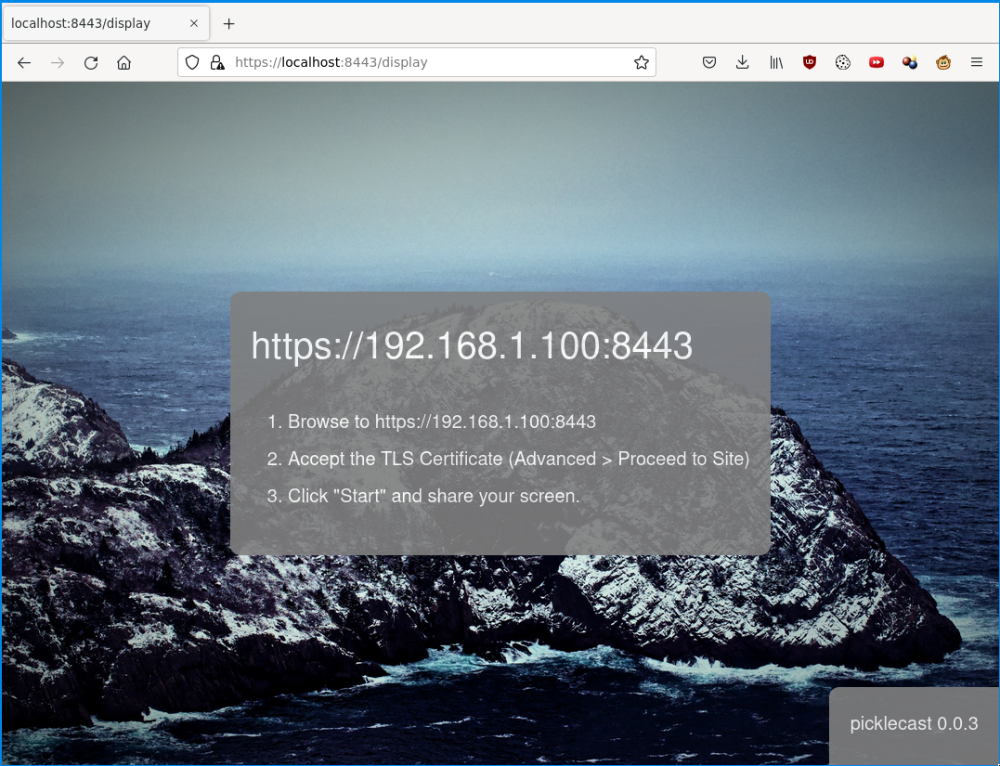

# picklecast - Simple Screen Cast Receiver

Screen share from a web-browser to a RaspberryPi or display computer connected to a projector or TV.

## Quickstart

    $ pip install picklecast
    $ picklecast
    Server address: 192.168.1.100
    Display URL: http://localhost:8443/display   http://192.168.1.100:8443/display
    Client URL: http://192.168.1.100:8443/
    
Then connect to the display URL from display computer, and the client URL from your personal device.
    
Optionally install a systemd service (Linux)

    picklecast install_service ~/.config/systemd/user
    systemctl --user daemon-reload
    systemctl --user start picklecast

## How it Works

Picklecast is just a Python program that serves HTML and relays handshake messages between two browsers.  The streaming and displaying is handled in Javascript in the display/client browsers using the WebRTC api.

