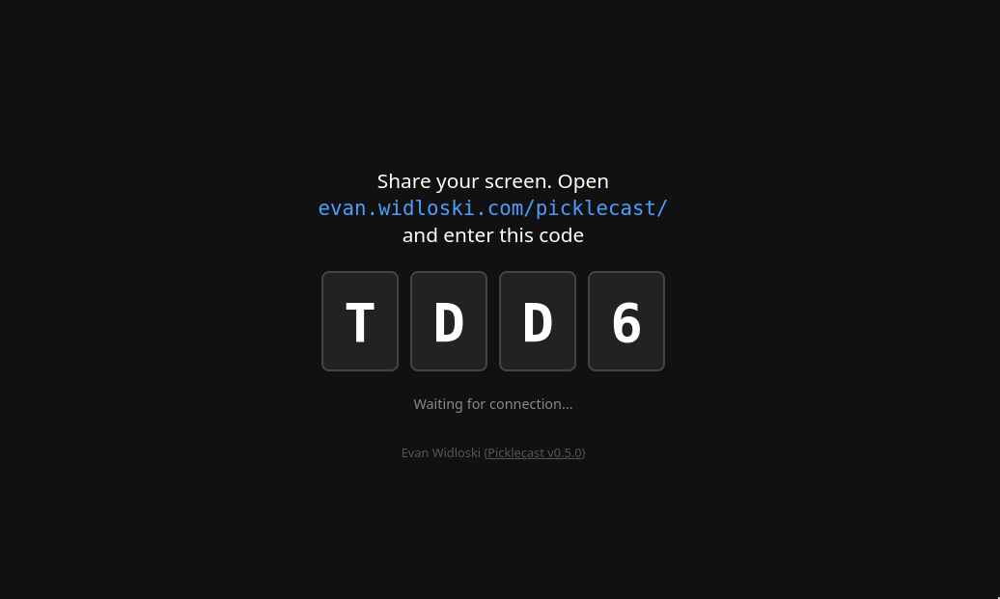

# picklecast - WebRTC Screen Caster

Eliminate your dependence on Chromecast!

Screen share to a RaspberryPi or display computer connected to a projector or TV.

[Access Picklecast here](http://evidlo.github.io/picklecast/display.html)

## How it Works

Picklecast is a client-side application that uses [p2pt](https://github.com/subins2000/p2pt) to establish the initial handshake between two browsers before setting up the WebRTC stream.

The app is hosted entirely on Github pages and has no backend (aside from public Webtorrent servers).

## Caveats

- Audio sharing only supported from Chrome ([bugzilla](https://bugzilla.mozilla.org/show_bug.cgi?id=1541425)).
- Currently there can be only one browser open to the display URL at a time
- Only desktop browsers are supported, as mobile browsers don't support [getDisplayMedia](https://caniuse.com/?search=getDisplayMedia)
- I've had issues getting the WebRTC APIs working correctly with Chrome on Windows.  Help on this issue would be appreciated.
